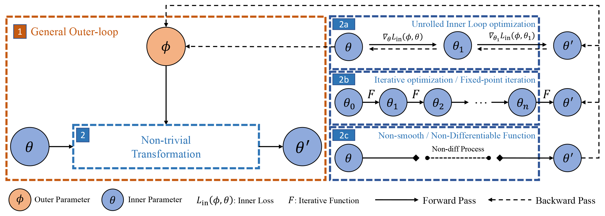

<!-- markdownlint-disable first-line-h1 -->
<!-- markdownlint-disable html -->

<div align="center">
  
</div>


[](https://pypi.org/project/torchopt)

[](https://torchopt.readthedocs.io)
[](https://pepy.tech/project/torchopt)
[](https://github.com/metaopt/torchopt/stargazers)
[](#license)

**TorchOpt** is an efficient library for differentiable optimization built upon [PyTorch](https://pytorch.org). TorchOpt is:

- **Comprehensive**: TorchOpt provides three differentiation mode - explicit differentiation, implicit differentiation and zero-order differentiation for handling different differenable optimization situations.
- **Flexible**: TorchOpt provides both functional and objective-oriented API for user different preferences. Users can implement differentiable optimization in JAX-like or PyTorch-like style.
- **Efficient**: TorchOpt provides (1) CPU/GPU acceleration differentiable optimizer (2) RPC-based distributed training framework (3) Tree Operation parallelism, to largely increase the training efficiency for bi-level optimization problem.

Beyond differentiable optimization, torchopt can also be regarded as a functional optimizer which enables [JAX-like](https://github.com/google/jax) composable functional optimizer for PyTorch. With TorchOpt, one can easily conduct neural network optimization in PyTorch with functional style optimizer, similar to  [Optax](https://github.com/deepmind/optax) in JAX.

--------------------------------------------------------------------------------

The README is organized as follows:
- [TorchOpt as Functional Optimizer](#torchopt-as-functional-optimizer)
  - [Optax-Like API](#optax-like-api)
  - [PyTorch-Like API](#pytorch-like-api)
  - [Differentiable](#differentiable)
- [TorchOpt for Differentiable topimization](#torchopt-for-differentiable-optimization)
  - [Explicit Gradient](#explicit-gradient)
  - [Implicit Gradient](#implicit-gradient)
  - [Zero-order Gradient](#zero-order-gradient)
- [High-Performance and Distributed Training](#high-performance-and-distributed-training)
- [Visualization](#visualization)
- [Examples](#examples)
- [Installation](#installation)
- [Changelog](#changelog)
- [The Team](#the-team)
- [Citing TorchOpt](#citing-torchopt)

--------------------------------------------------------------------------------
## TorchOpt as Functional Optimizer

The design of TorchOpt follows the philosophy of functional programming. Aligned with [`functorch`](https://github.com/pytorch/functorch), users can conduct functional style programing with models, optimizers and training in PyTorch. We use the Adam optimizer as an example in the following illustration. You can also check out the tutorial notebook [Functional Optimizer](tutorials/1_Functional_Optimizer.ipynb) for more details.

### Optax-Like API

For those users who prefer fully functional programing, we offer Optax-Like API by passing gradients and optimizers states to the optimizer function. We design base class `torchopt.Optimizer` that has the same interface as `torch.optim.Optimizer`. Here is an example coupled with `functorch`:

```python

class Net(nn.Module): ...

class Loader(DataLoader): ...

net = Net()  # init
loader = Loader()
optimizer = torchopt.adam()

model, params = functorch.make_functional(net)           # use functorch extract network parameters
opt_state = optimizer.init(params)                       # init optimizer

xs, ys = next(loader)                                    # get data
pred = model(params, xs)                                 # forward
loss = F.cross_entropy(pred, ys)                         # compute loss

grads = torch.autograd.grad(loss, params)                # compute gradients
updates, opt_state = optimizer.update(grads, opt_state)  # get updates
params = torchopt.apply_updates(params, updates)         # update network parameters
```

We also provide a wrapper `torchopt.FuncOptimizer` to make maintaining the optimizer state easier:

```python
net = Net()  # init
loader = Loader()
optimizer = torchopt.FuncOptimizer(torchopt.adam())      # wrap with `torchopt.FuncOptimizer`

model, params = functorch.make_functional(net)           # use functorch extract network parameters

for xs, ys in loader:                                    # get data
    pred = model(params, xs)                             # forward
    loss = F.cross_entropy(pred, ys)                     # compute loss

    params = optimizer.step(loss, params)                # update network parameters
```

### PyTorch-Like API

We also offer origin PyTorch APIs (e.g. `zero_grad()` or `step()`) by wrapping our Optax-Like API for traditional PyTorch user:

```python
net = Net()  # init
loader = Loader()
optimizer = torchopt.Adam(net.parameters())

xs, ys = next(loader)             # get data
pred = net(xs)                    # forward
loss = F.cross_entropy(pred, ys)  # compute loss

optimizer.zero_grad()             # zero gradients
loss.backward()                   # backward
optimizer.step()                  # step updates
```

### Differentiable

On top of the same optimization function as `torch.optim`, an important benefit of functional optimizer is that one can implement differentiable optimization easily. This is particularly helpful when the algorithm requires to differentiate through optimization update (such as meta learning practices). We take as the inputs the gradients and optimizer states, use non-in-place operators to compute and output the updates. The processes can be automatically implemented, with the only need from users being to pass the argument `inplace=False` to the functions. You can check [Explicit Gradient](#explicit-gradient) functional API for example.

--------------------------------------------------------------------------------

## TorchOpt for Differentiable Optimization

We design a bilevel-optimization updating scheme, which can be easily extended to realize various differentiable optimization processes. 

<div align="center">
  
</div>

As shown above, the scheme contains an outer level that has parameters $\phi$ that can be learned end-to-end through the inner level parameters solution $\theta^{\star}(\phi)$ by using the best-response derivatives $\partial \theta^{\star}(\phi)/ \partial \phi$. TorchOpt supports three differentiation modes. It can be seen that the key component of this algorithm is to calculate the best-response (BR) Jacobian. From the BR-based perspective, existing gradient methods can be categorized into three groups: explicit gradient over unrolled optimization, implicit differentiation, and zero-order gradient differentiation.

### Explicit Gradient
The idea of explicit gradient is to treat the gradient step as a differentiable function and try to backpropagate through the unrolled optimization path. This differentiation mode is suitable for algorithms when the inner-level optimization solution is obtained by a few gradient steps, such as [MAML](https://arxiv.org/abs/1703.03400), [MGRL](https://arxiv.org/abs/1805.09801). TorchOpt offers both functional and object-oriented API for EG to fit different user applications. 
#### Functional API
The functional API is to conduct optimization in a functional programming style. Note that we pass the argument `inplace=False` to the functions to make the optimization differentiable. Refer to the notebook [Functional Optimizer](tutorials/1_Functional_Optimizer.ipynb) for more guidances.
```python
# Functional API
optimizer = torchopt.adam()
# Define meta and inner parameters
meta_params = ...
fmodel, params = make_functional(model)
# Initial state
state = optimizer.init(params)

for iter in range(iter_times):
    loss = inner_loss(fmodel, params, meta_params)                
    grads = torch.autograd.grad(loss, params)
    # Apply non-inplace parameter update
    updates, state = optimizer.update(grads, state, inplace=False)
    params = torchopt.apply_updates(params, updates)   
    
loss = outer_loss(fmodel, params, meta_params)
meta_grads = torch.autograd.grad(loss, meta_params)
```

#### OOP API
TorchOpt also provides OOP API compatible with PyTorch programming style. Refer to the example and the notebook [Meta Optimizer](tutorials/3_Meta_Optimizer.ipynb), [Stop Gradient](tutorials/4_Stop_Gradient.ipynb) for more guidances.
```python
# OOP API
# Define meta and inner parameters
meta_params = ...
model = ...
# Define differentiable optimizer
optimizer = torchopt.MetaAdam(model.parameters())

for iter in range(iter_times):
    # perform inner update
    loss = inner_loss(model, meta_params)  
    optimizer.step(loss)
    
loss = outer_loss(model, meta_params)
loss.backward()
```

### Implicit Gradient
By treating the solution $\theta^{\star}$ as an implicit function of $\phi$, the idea of IG is to directly get analytical best-response derivatives $\partial \theta^{\star}(\phi)/ \partial \phi$ by [implicit function theorem](https://en.wikipedia.org/wiki/Implicit_function_theorem). This is suitable for algorithms when the inner-level optimal solution is achieved $\frac{\partial F(\theta, \phi)}{\partial \theta} |_{\theta^{\star}} = 0$ or reaches some stationary conditions $F(\theta^{\star}, \phi)=0$, such as [iMAML](https://arxiv.org/abs/1909.04630), [DEQ](https://arxiv.org/abs/1909.01377). TorchOpt offers functional/OOP API for supporting both [conjugate gradient-based](https://arxiv.org/abs/1909.04630) and [Neumann series](https://arxiv.org/abs/1911.02590) based IG method. Refer to the example [IMAML](https://github.com/waterhorse1/torchopt/tree/readme/examples/iMAML) and the notebook [Implicit Gradient](tutorials/5_Implicit_Differentiation.ipynb) for more guidances.
#### Functional API
For implicit gradient, users need to define the stationary condition and TorchOpt provides the decorator to warp the solve function for enabling implicit gradient computation.
```python
# Functional API for implicit gradient
def stationary(params, meta_params, data):
    # stationary condition construction
    return stationary condition

# Decorator for warpping the function
# and specify the linear solver (conjugate gradient or neumann series)
@torchopt.implicit.custom_root(stationary, linear_solver)
def solve(params, meta_params, data):
    # forward optimization process for params
    return output
    
# Define params, meta params and get data
params, meta_prams, data = ..., ..., ...
optimal_params = solve(params, meta_params, data)
loss = outer_loss(optimal_params)

meta_grads = torch.autograd.grad(loss, meta_params)
```
#### OOP API
Torchopt also offer an OOP API, users need to inherit from the class ImplicitMetaGradientModule to construct the inner-loop network. Users need to define the stationary condition/objective function and the inner-loop solve function to enable implicit gradient computation.
```python
# Inherited from the class ImplicitMetaGradientModule
# and specify the linear solver (conjugate gradient or neumann series)
class InnerNet(ImplicitMetaGradientModule, linear_solver):
    def __init__(self):
        ...
    def forward(self):
        # forward process
        ...
    def optimality(self):
        # stationary condition construction for calculateing implicit gradient
        # If this method is not implemented, it will be
        # automatically derived from the gradient of the `objective` function.
        ...
    def objective(self):
        # define the inner-loop optimization objective
        ...
    def solve(self, data):
        # conduct the inner-loop optimization
        ...

# get meta_params and data
meta_params, data = ..., ...
inner_net = InnerNet()

# solve for inner-loop process
# related with the meta parameters
optimal_inner_net = inner_net.solve(meta_params, data)

# get outer loss and solve for meta gradient
loss = outer_loss(optimal_inner_net)
meta_grad = torch.autograd.grad(loss, meta_params)
```

### Zero-order gradient
When the inner-loop process is non-differentiable or one wants to eliminate the heavy computation burdens in the previous two modes (brought by Hessian), one can choose Zero-order gradient (ZD). ZD typically gets gradients based on zero-order estimation, such as finite-difference, or [Evolutionary Strategy](https://arxiv.org/abs/1703.03864). Instead of optimizing the objective $F$, ES optimize a smoothed objective. TorchOpt provides functional and OOP API for the ES method. Refer to the notebook [Zero-order gradient](tutorials/6_zero_order.ipynb) for more guidances.
#### Functional API
```python
# Functional API
# Specify method and parameter of ES
@torchopt.zero_order.es_grad(method, params)
def forward(meta_params, data):
    # forward process
    return output
```
--------------------------------------------------------------------------------
## High-Performance and Distributed Training
### CPU/GPU accelerated differentiable optimizer
We take the optimizer as a whole instead of separating it into several basic operators (e.g., *sqrt* and *div*}). Therefore, by manually writing the forward and backward functions, we can perform the symbolic reduction. In addition, we can store some intermediate data that can be reused during the back-propagation. We write the accelerated functions in C++ OpenMP and CUDA, bind them by `pybind11` to allow they can be called by Python, and then we define the forward and backward behavior using `torch.autograd.Function`. User can use by simply setting the `use_accelerated_op` flag as `True`. Refer to the correpsonding sections in [Functional Optimizer](tutorials/1_Functional_Optimizer.ipynb) and [Meta Optimizer](tutorials/3_Meta_Optimizer.ipynb)

```python
optimizer = torchopt.MetaAdam(net, lr, use_accelerated_op=True)
```

### Distributed Training
`TorchOpt` provides distributed training features based on the PyTorch RPC module for better training speed and multi-node multi-GPU support. Different from the MPI-like parallelization paradigm, which uses multiple homogenous workers and requires carefully designed communication hooks, the RPC APIs allow users to build their optimization pipeline more flexibly. Experimental results show that we achieve approximately linear relationship between the speed-up ratio and the number of workers. Check the [distributed MAML example](https://github.com/metaopt/torchopt/tree/main/examples/distributed/few-shot) for more specific guidance.

### OpTree
We implement the *PyTree* to enable fast nested structure flatten using C++. The tree operations (e.g., flatten and unflatten) are very important in enabling functional and Just-In-Time (JIT) features of deep learning frameworks. By implementing it in C++, we can use some cache/memory friendly structures (e.g., `absl::InlinedVector`) to improve the performance. For more guidance and comparison results, refer to our open source project [`OpTree`](https://github.com/metaopt/optree).

--------------------------------------------------------------------------------

## Visualization

Complex gradient flow in meta-learning brings in a great challenge for managing the gradient flow and verifying the correctness of it. TorchOpt provides a visualization tool that draw variable (e.g. network parameters or meta parameters) names on the gradient graph for better analyzing. The visualization tool is modified from [`torchviz`](https://github.com/szagoruyko/pytorchviz). Refer to the example [visualization code](examples/visualize.py) and the notebook [Visualization](tutorials/2_Visualization.ipynb) for more details.

The figure below show the visualization result. Compared with [`torchviz`](https://github.com/szagoruyko/pytorchviz), TorchOpt fuses the operations within the `Adam` together (orange) to reduce the complexity and provide simpler visualization.

<div align="center">
  
</div>

--------------------------------------------------------------------------------
## Examples

In [`examples`](examples), we offer several examples of functional optimizer and light-weight meta-learning examples with TorchOpt.

- [Model Agnostic Meta Learning (MAML) - Supervised Learning](https://arxiv.org/abs/1703.03400) (ICML 2017)
- [Learning to Reweight Examples for Robust Deep Learning](https://arxiv.org/abs/1803.09050) (ICML 2018)
- [Model Agnostic Meta Learning (MAML) - Reinforcement Learning](https://arxiv.org/abs/1703.03400) (ICML 2017)
- [Meta Gradient Reinforcement Learning (MGRL)](https://arxiv.org/abs/1805.09801) (NeurIPS 2018)
- [Learning through opponent learning process (LOLA)](https://arxiv.org/abs/1709.04326) (AAMAS 2018)
- [Meta-Learning with Implicit Gradients](https://arxiv.org/abs/1909.04630) (NeurIPS 2019)

Also check [`examples`](examples) for more distributed/visuaization/functorch-compatible examples.

--------------------------------------------------------------------------------


## Installation

Requirements

- PyTorch
- (Optional) For visualizing computation graphs
  - [Graphviz](https://graphviz.org/download) (for Linux users use `apt/yum install graphviz` or `conda install -c anaconda python-graphviz`)

**Please follow the instructions at <https://pytorch.org> to install PyTorch in your Python environment first.** Then run the following command to install TorchOpt from PyPI ([](https://pypi.org/project/torchopt) / ):

```bash
pip3 install torchopt
```

If the minimum version of PyTorch is not satisfied, `pip` will install/upgrade it for you. Please be careful about the `torch` build for CPU / CUDA support (e.g. `cpu`, `cu116`, `cu117`). You may need to specify the extra index URL for the `torch` package:

```bash
pip3 install torchopt --extra-index-url https://download.pytorch.org/whl/cu117
```

See <https://pytorch.org> for more information about installing PyTorch.

You can also build shared libraries from source, use:

```bash
git clone https://github.com/metaopt/torchopt.git
cd torchopt
pip3 install .
```

We provide a [conda](https://github.com/conda/conda) environment recipe to install the build toolchain such as `cmake`, `g++`, and `nvcc`:

```bash
git clone https://github.com/metaopt/torchopt.git
cd torchopt

# You may need `CONDA_OVERRIDE_CUDA` if conda fails to detect the NVIDIA driver (e.g. in docker or WSL2)
CONDA_OVERRIDE_CUDA=11.7 conda env create --file conda-recipe.yaml

conda activate torchopt
make install-editable  # or run `pip3 install --no-build-isolation --editable .`
```

--------------------------------------------------------------------------------

## Changelog

See [CHANGELOG.md](CHANGELOG.md).

--------------------------------------------------------------------------------

## The Team

TorchOpt is a work by Jie Ren, [Xidong Feng](https://github.com/waterhorse1), [Bo Liu](https://github.com/Benjamin-eecs), [Xuehai Pan](https://github.com/XuehaiPan), [Luo Mai](https://luomai.github.io/) and [Yaodong Yang](https://www.yangyaodong.com/).

## Citing TorchOpt

If you find TorchOpt useful, please cite it in your publications.

```bibtex
@software{TorchOpt,
  author       = {Jie Ren and Xidong Feng and Bo Liu and Xuehai Pan and Luo Mai and Yaodong Yang},
  title        = {TorchOpt},
  year         = {2022},
  publisher    = {GitHub},
  journal      = {GitHub repository},
  howpublished = {\url{https://github.com/metaopt/torchopt}}
}
```
