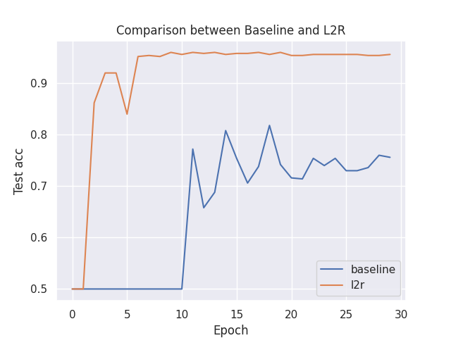

# Learning-to-reweight-examples

Code on MNIST re-weighting example in paper [Learning to Reweight Examples for Robust Deep Learning](https://arxiv.org/abs/1803.09050)] using TorchOpt. The idea of L2R is to use virtual update of inner-loop neural network optimization to meta-learn the re-weighting parameters for robust deep learning. We use `MetaSGD` as the inner-loop optimizer.

## Usage

We use traditional supervised training as the baseline.

```bash
### Run both algorithms and conduct comparison
python3 l2r.py --algo both

### For baseline
python3 l2r.py --algo baseline

### For L2R algorithm
python3 l2r.py --algo l2r
```

## Results

The test accuracy comparison between baseline and L2R validate the effectiveness of algorithms.

<div align=center>
  
</div>
