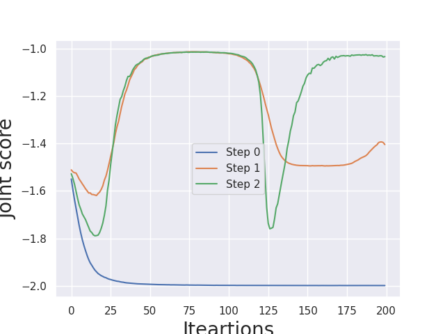

# LOLA-examples

Code On LOLA a in paper [Learning with Opponent-Learning Awareness](https://arxiv.org/abs/1709.04326)] using TorchOpt. The LOLA learning rule includes a term that accounts for the impact of one agent's policy on the anticipated parameter update of the other agents. We use `MetaSGD` as the inner-loop optimiser.

## Usage

```bash
### Run LOLA
python3 lola_dice.py

### After get the result.npy, run visualization code
python3 visualise.py
```

## Results

The figure illustrate the experimental result.

<div align=center>
  
</div>
