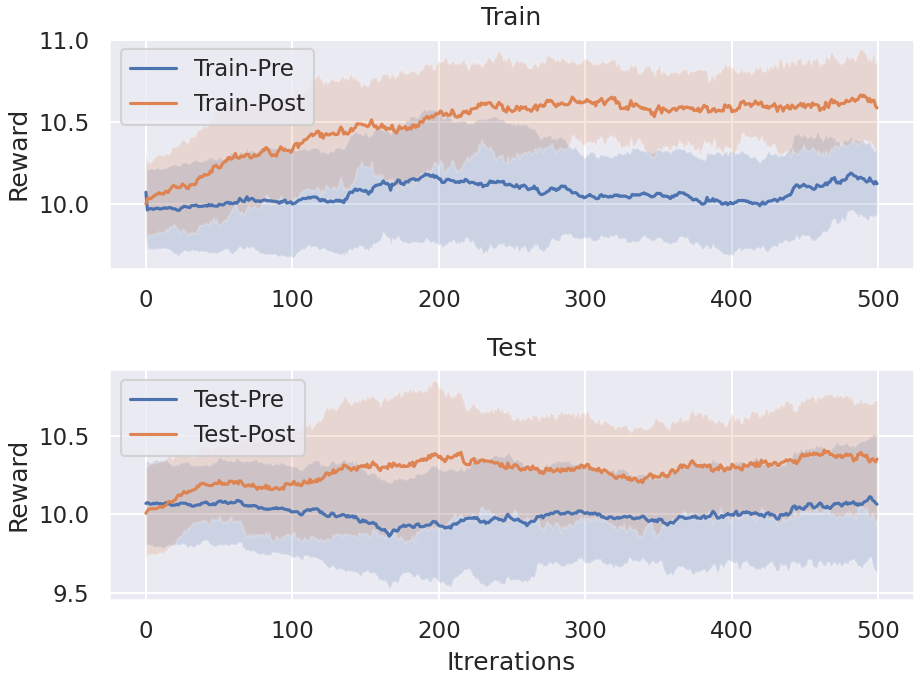

# Reinforcement learning with Model-Agnostic Meta-Learning (MAML)

Code on Tabular MDP example in paper *Model-Agnostic Meta-Learning* [[MAML](https://arxiv.org/abs/1703.03400)] using TorchOpt. The idea of MAML is to learn the initial parameters of an agent's policy so that the agent can rapidly adapt to new environments with a limited number of policy-gradient updates. We use `MetaSGD` as the inner-loop optimiser.

## Usage

Specify the seed to train.

```bash
### Run MAML
python run_MAML.py --seed 1
```

## Results

The training curve and testing curve between initial policy and adapted policy validate the effectiveness of algorithms.

<div align=center>
  
</div>
