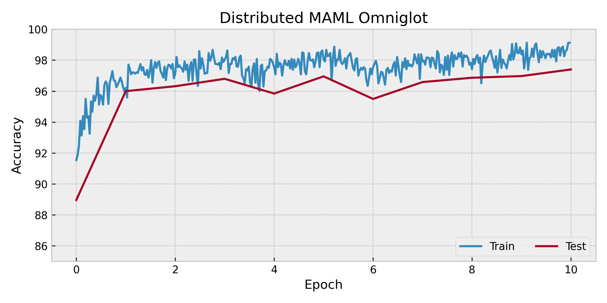

# MAML few-shot Omniglot classification-examples

Code on MAML few-shot Omniglot classification in paper [Model-Agnostic Meta-Learning for Fast Adaptation of Deep Networks](https://arxiv.org/abs/1703.03400) using TorchOpt. We use `MetaSGD` as the inner-loop optimizer.

## Usage

```bash
### Run
torchrun --nnode 1 --nproc_per_node 8 maml_omniglot.py
```

## Results

The figure illustrate the experimental result.

<div align=center>
  
</div>
