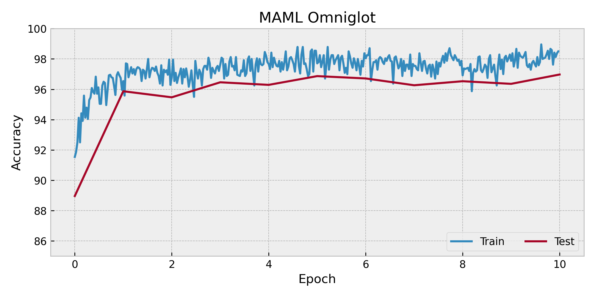

# MAML few-shot Omniglot classification-examples

Code On MAML few-shot Omniglot classification in paper [Model-Agnostic Meta-Learning for Fast Adaptation of Deep Networks](https://arxiv.org/abs/1703.03400) using `TorchOpt`. We use `MetaSGD` as the inner-loop optimiser.

# Usage
```bash
### Run 
python3 maml-omniglot.py
```

# Results
The figure illustrate the experimental result.
<div align=center>

</div>
