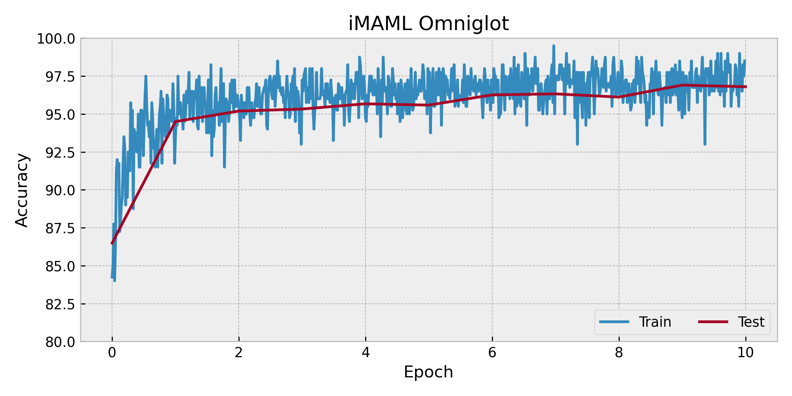
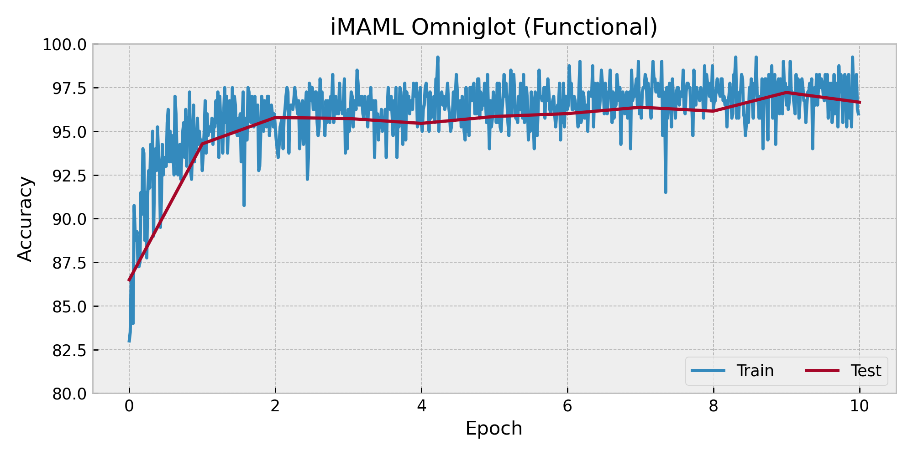

# implicit MAML few-shot Omniglot classification-examples

Code on implicit MAML few-shot Omniglot classification in paper [Meta-Learning with Implicit Gradients](https://arxiv.org/abs/1909.04630) using TorchOpt. We use `torchopt.sgd` as the inner-loop optimizer.

## Usage

```bash
### Run
python3 imaml_omniglot.py --inner_steps 5             # use OOP APIs
python3 imaml_omniglot_functional.py --inner_steps 5  # use functional APIs
```

## Results

The figure illustrate the experimental result.

<div align=center>
  
</div>

<div align=center>
  
</div>
